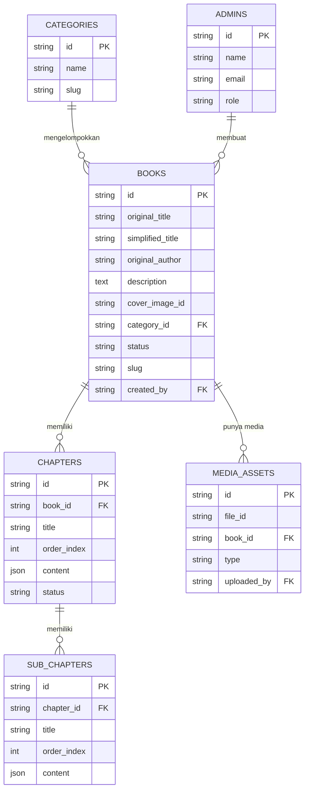
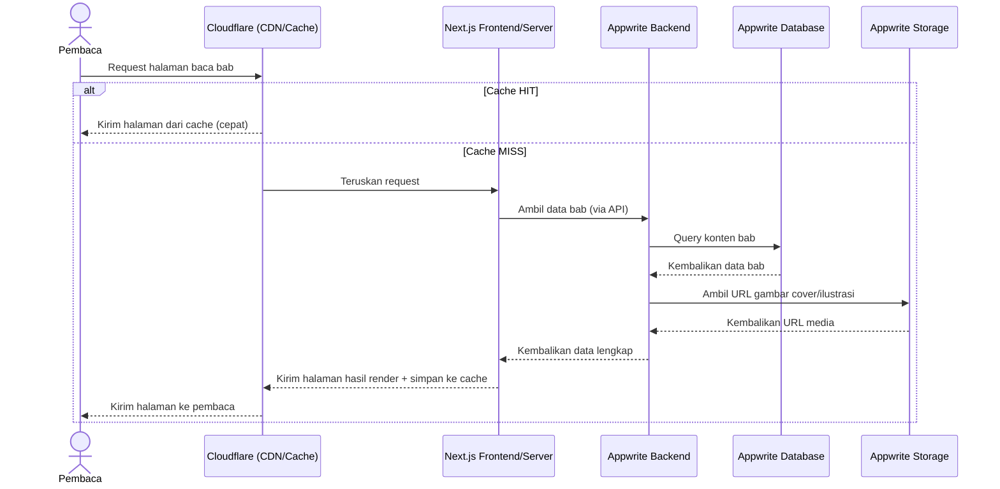
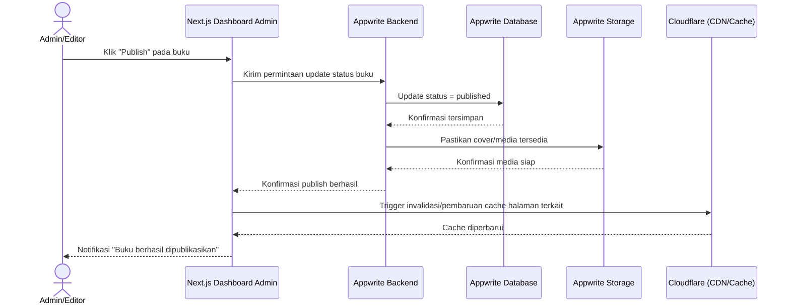

# PRD: Simplify Library
**Tagline:** *"Sederhanakan narasi, percepat pemahaman."*

> Dokumen ini disusun berdasarkan abstraksi yang diberikan klien serta jawaban klarifikasi. Setiap keputusan atau isian yang tidak disebutkan secara eksplisit oleh klien ditandai dengan **[ASUMSI]** beserta alasannya, agar mudah dikonfirmasi sebelum development dimulai.

---

## 1. Product Overview

**Visi Produk:**
Simplify Library adalah platform baca digital yang mengubah buku-buku yang sudah ada — terutama buku hukum — menjadi ringkasan terstruktur (Buku → Bab → Sub-bab) yang mudah dan cepat dipahami, tersedia gratis untuk siapa saja, khususnya mahasiswa hukum.

**Tipe Pengguna:**
| Tipe Pengguna | Peran |
|---|---|
| **Admin/Editor** | Menyederhanakan buku yang sudah ada, mengatur struktur Bab/Sub-bab, mengelola kategori, dan mempublikasikan konten. |
| **Pembaca (Publik)** | Membaca ringkasan buku secara gratis tanpa perlu mendaftar/login. |

**Tujuan Bisnis** *(non-komersial — proyek berorientasi dampak sosial/edukasi, bukan revenue)*:
- Menyediakan akses gratis dan mudah ke ringkasan buku hukum yang terstruktur rapi.
- Membantu mahasiswa hukum (dan masyarakat umum) memahami inti buku tanpa harus membaca versi lengkap yang tebal dan berat bahasanya.
- Membangun koleksi buku yang bertumbuh konsisten sebagai sumber belajar jangka panjang.

**Metrik Keberhasilan (terukur):**
- **[ASUMSI]** Jumlah pembaca aktif bulanan mencapai 1.000 pengguna dalam 3 bulan pertama setelah rilis (baseline awal sebelum menuju target 50.000 jangka panjang).
- **[ASUMSI]** Minimal 4 buku baru dipublikasikan per bulan oleh tim editor.
- Rata-rata jumlah bab yang dibaca per sesi kunjungan (indikator keterbacaan & kualitas konten).
- Rasio pencarian yang berujung pada pembacaan bab (search-to-read conversion) ≥ 40%. **[ASUMSI]**
- Uptime sistem ≥ 99.5% per bulan.

---

## 2. User Personas

### Persona 1 — Admin/Editor
- **Nama:** Rani
- **Usia & latar belakang:** 27 tahun, alumni Fakultas Hukum, kini menjadi relawan/editor konten literasi.
- **Kemahiran teknologi:** Menengah — terbiasa Google Docs, Notion, media sosial; belum pernah pakai CMS/dashboard admin kompleks.
- **Tujuan:** Menyederhanakan buku hukum tebal menjadi bab-bab ringkas secepat dan serapi mungkin, tanpa hambatan teknis.
- **Masalah saat ini:** Menata ulang isi buku di Word/Google Docs berantakan, sulit dikategorikan, dan susah dipublikasikan ke pembaca secara rapi.
- **Interaksi harian:** Login ke dashboard admin → buat entri buku baru → tulis/tempel isi ke editor block-based → atur bab & sub-bab → pilih kategori → publish.

### Persona 2 — Pembaca Utama (Mahasiswa Hukum)
- **Nama:** Dimas
- **Usia & latar belakang:** 20 tahun, mahasiswa Hukum semester 4.
- **Kemahiran teknologi:** Tinggi — pengguna smartphone native, terbiasa membaca artikel/e-book di HP.
- **Tujuan:** Memahami inti buku hukum dengan cepat, terutama menjelang ujian atau tugas.
- **Masalah saat ini:** Buku hukum tebal, bahasa akademis berat, waktu baca terbatas.
- **Interaksi harian:** Buka situs dari HP → cari buku via search/kategori → baca bab per bab saat waktu senggang (di kelas, transportasi) → kadang membagikan tautan bab ke teman.

### Persona 3 — Pembaca Umum (Publik)
- **Nama:** Budi
- **Usia & latar belakang:** 45 tahun, praktisi/pekerja umum yang ingin memperbarui wawasan hukum.
- **Kemahiran teknologi:** Menengah.
- **Tujuan:** Mendapat pemahaman cepat tentang topik hukum tertentu tanpa membaca buku tebal.
- **Masalah saat ini:** Tidak punya waktu/latar belakang untuk membaca buku hukum akademis.
- **Interaksi harian:** Sesekali membuka situs lewat browser desktop saat mencari topik spesifik lewat search engine.

---

## 3. Feature Requirements

| Fitur | Deskripsi | User Story | Prioritas | Kriteria Penerimaan | Dependensi |
|---|---|---|---|---|---|
| Login Admin | Autentikasi untuk Admin/Editor | Sebagai Admin, saya ingin login dengan aman, agar hanya saya/tim yang bisa mengelola konten | Must | Login berhasil dengan email+password valid; gagal login menampilkan pesan error jelas; sesi otomatis logout setelah tidak aktif 30 menit **[ASUMSI]** | - |
| Manajemen Buku | CRUD data buku: judul asli, judul simplifikasi, penulis, deskripsi, cover, kategori | Sebagai Admin, saya ingin membuat entri buku baru, agar saya bisa mulai menyederhanakan isinya | Must | Admin dapat membuat, mengedit, menghapus buku; field wajib tervalidasi sebelum simpan | Login Admin |
| Editor Konten Block-based | Editor bergaya AFFiNE/BlockSuite untuk menulis isi Bab & Sub-bab | Sebagai Admin, saya ingin menulis/tempel isi ringkasan dengan format blok yang rapi, agar proses menulis nyaman dan hasilnya terstruktur | Must | Admin bisa membuat heading, paragraf, list, quote, dsb; hasil tulisan tersimpan otomatis (autosave) | Manajemen Buku |
| Manajemen Struktur Hierarki | Mengatur urutan & susunan Bab/Sub-bab dalam satu buku | Sebagai Admin, saya ingin mengatur urutan bab dengan drag-and-drop, agar struktur buku sesuai alur logis | Must | Perubahan urutan tersimpan dan langsung tercermin di tampilan pembaca | Editor Konten |
| Manajemen Kategori | CRUD kategori buku | Sebagai Admin, saya ingin mengelompokkan buku ke kategori, agar pembaca mudah menemukan topik yang relevan | Must | Admin bisa buat/edit/hapus kategori; kategori terhubung ke buku | Manajemen Buku |
| Status Draft/Published | Menyimpan buku sebagai draft sebelum dipublikasikan | Sebagai Admin, saya ingin menyimpan buku sebagai draft, agar saya bisa menyelesaikannya bertahap tanpa terlihat publik | Should | Buku berstatus draft tidak muncul di katalog publik; hanya published yang tampil | Manajemen Buku |
| Upload Media | Upload cover buku & ilustrasi | Sebagai Admin, saya ingin mengunggah gambar cover, agar buku terlihat menarik di katalog | Must | Format JPG/PNG/WebP maks 5MB **[ASUMSI]** ; preview gambar sebelum simpan | Manajemen Buku |
| Preview Sebelum Publish | Melihat tampilan pembaca sebelum publish | Sebagai Admin, saya ingin melihat pratinjau, agar saya yakin tampilannya sudah rapi sebelum dipublikasikan | Should | Preview identik dengan tampilan publik final | Editor Konten |
| Dashboard Ringkas Admin | Halaman ringkasan jumlah buku, kategori, status | Sebagai Admin, saya ingin melihat ringkasan aktivitas, agar saya tahu progres konten secara cepat | Could | Menampilkan angka total buku, draft, published, kategori | Manajemen Buku |
| Landing Page (Hero) | Halaman utama dengan hero section sesuai desain | Sebagai Pembaca, saya ingin melihat tampilan awal yang menarik, agar saya tertarik menjelajah koleksi | Must | Hero tampil sesuai referensi desain (split layout, CTA, carousel), responsif di semua ukuran layar | - |
| Katalog Buku + Filter Kategori | Menampilkan seluruh buku published dengan filter kategori | Sebagai Pembaca, saya ingin memfilter buku berdasarkan kategori, agar saya cepat menemukan topik yang saya butuhkan | Must | Filter kategori memperbarui daftar buku tanpa reload penuh halaman | Manajemen Kategori |
| Search Buku | Pencarian judul/penulis/kategori | Sebagai Pembaca, saya ingin mencari buku dengan kata kunci, agar saya tidak perlu menelusuri seluruh katalog | Must | Hasil pencarian relevan muncul < 1 detik untuk katalog hingga ribuan buku; pesan jelas jika tidak ditemukan | Katalog Buku |
| Toggle Tampilan Grid/List | Mengubah tampilan katalog: cover grid atau list | Sebagai Pembaca, saya ingin memilih tampilan cover atau list, agar sesuai preferensi membaca saya | Must | Toggle berfungsi tanpa reload, preferensi tersimpan selama sesi | Katalog Buku |
| Halaman Detail Buku | Cover, deskripsi, daftar bab | Sebagai Pembaca, saya ingin melihat ringkasan & daftar bab sebelum membaca, agar saya tahu apa yang akan saya baca | Must | Menampilkan semua metadata buku dan daftar bab berurutan sesuai struktur admin | Manajemen Buku |
| Halaman Baca Bab/Sub-bab | Tampilan membaca isi bab yang telah diformat block editor | Sebagai Pembaca, saya ingin membaca isi bab dengan nyaman, agar pengalaman membaca setara buku digital | Must | Format tulisan (heading, list, quote) tampil sesuai yang ditulis admin; teks nyaman dibaca di mobile & desktop | Editor Konten |
| Navigasi Next/Prev Bab | Tombol lanjut/kembali antar bab | Sebagai Pembaca, saya ingin lanjut ke bab berikutnya tanpa kembali ke daftar, agar alur membaca tidak terputus | Should | Tombol next/prev muncul konsisten & mengarah ke bab yang benar sesuai urutan | Halaman Baca |
| Halaman About Us/Contact Us | Halaman statis informasi proyek & kontak | Sebagai Pembaca, saya ingin tahu latar belakang proyek ini, agar saya percaya pada kredibilitasnya | Should | Konten dapat diedit admin tanpa perlu developer | Login Admin |
| Halaman News | Berita/update seputar proyek atau dunia hukum | Sebagai Pembaca, saya ingin membaca update terbaru, agar saya tetap terhubung dengan perkembangan | Could | Admin bisa menambah/edit artikel News sederhana | Login Admin |
| Bookmark Pembaca | Menyimpan buku favorit pembaca | — | **Won't** (MVP) | Ditunda karena sesuai keputusan klien: pembaca tidak memerlukan akun/tracking | Login Pembaca (belum ada) |
| Tracking Progres Baca | Menyimpan progres baca pembaca | — | **Won't** | Secara eksplisit tidak dibutuhkan sesuai brief klien | - |

---

## 4. User Flows

### Flow A — Admin Menyederhanakan & Mempublikasikan Buku
1. Admin login ke dashboard.
2. Admin klik "Buku Baru", mengisi metadata (judul asli, judul simplifikasi, penulis, kategori, cover).
3. Sistem menyimpan entri buku dengan status **draft**.
4. Admin membuka editor, menambahkan Bab 1, menulis/menempel ringkasan menggunakan block editor.
5. Admin menambahkan sub-bab bila diperlukan, mengatur urutan bab/sub-bab.
6. Admin menekan "Preview" untuk melihat tampilan seperti yang akan dilihat pembaca.
7. Admin menekan "Publish".
8. Sistem mengubah status menjadi **published**; buku otomatis muncul di katalog publik.

**Jalur alternatif:** Admin menyimpan sebagai draft tanpa publish → buku tidak tampil ke publik, bisa dilanjutkan kapan saja.

**Kondisi error:** Jika field wajib (judul, kategori) kosong saat mencoba publish → sistem menampilkan pesan validasi spesifik dan mencegah publish sampai data lengkap.

### Flow B — Pembaca Mencari dan Membaca Buku
1. Pembaca membuka halaman utama.
2. Pembaca mengetik kata kunci di search bar, atau memilih filter kategori.
3. Sistem menampilkan hasil sesuai mode tampilan (grid/list) yang aktif.
4. Pembaca mengklik salah satu buku → masuk ke halaman detail (cover, deskripsi, daftar bab).
5. Pembaca mengklik salah satu bab → masuk ke halaman baca.
6. Pembaca membaca isi bab, dapat berpindah ke bab berikutnya/sebelumnya via tombol navigasi.

**Jalur alternatif:** Jika pencarian tidak menemukan hasil → sistem menampilkan pesan "Buku tidak ditemukan" beserta saran kategori populer.

**Kondisi error:** Jika pembaca mengakses tautan bab/buku yang sudah dihapus atau di-unpublish → sistem menampilkan halaman 404 kustom dengan tombol kembali ke katalog.

---

## 5. Non-Functional Requirements

| Aspek | Target |
|---|---|
| Waktu muat halaman | First Contentful Paint < 1.5 detik; halaman katalog & baca < 2 detik pada koneksi 4G rata-rata **[ASUMSI berdasarkan standar praktik web modern]** |
| Waktu respons sistem | API katalog/kategori merespons < 300ms pada beban normal |
| Concurrent users | Dirancang untuk menangani ±500 pengguna bersamaan di jam sibuk, mendukung total 1.000–50.000 pengguna aktif bulanan **[ASUMSI rasio umum aktif-bersamaan ~1-3%]** |
| Autentikasi | Hanya untuk Admin/Editor (email + password via Appwrite Auth); pembaca tidak memerlukan akun sesuai keputusan klien |
| Otorisasi | Dua peran: **Super Admin** (kelola semua buku + kelola akun editor lain) dan **Editor** (kelola buku miliknya) **[ASUMSI struktur peran minimal yang wajar untuk tim kecil]** |
| Perlindungan data | HTTPS/TLS wajib di semua koneksi; backup database harian otomatis; rate limiting pada endpoint publik untuk mencegah scraping/abuse berlebihan |
| Perangkat & browser | Chrome, Firefox, Safari, Edge (2 versi terakhir); mobile Safari iOS & Chrome Android |
| Rentang layar | 320px (mobile kecil) hingga 1920px+ (desktop besar); breakpoint standar 640/768/1024/1280px |
| Aksesibilitas | Minimal WCAG 2.1 level AA — kontras warna cukup (perhatian khusus pada kombinasi ungu terang di atas putih), navigasi keyboard, alt text pada gambar, ukuran font dasar ≥16px untuk kenyamanan baca teks panjang |

---

## 6. Technical Specifications

> Catatan: bagian ini adalah **panduan arah**, bukan spesifikasi implementasi yang mengikat.

### Frontend
**Rekomendasi:** Next.js (React) + Tailwind CSS.
**Alasan (bahasa awam):** Next.js memungkinkan halaman katalog dan halaman baca buku "dibekukan" menjadi file statis yang sangat cepat diakses tanpa harus terus-menerus mengambil data dari database setiap ada pembaca baru — ini langsung menjawab kekhawatiran Anda soal traffic tinggi. Tailwind CSS mempercepat penerapan desain kustom (ungu-putih-oranye-teal) secara konsisten di seluruh halaman.

**Editor Admin:** BlockSuite versi modifikasi milik Anda (page editor saja, tanpa mode edgeless) — sudah menjadi keputusan Anda, sehingga tidak direkomendasikan ulang, hanya dicatat sebagai bagian dari antarmuka admin.

### Backend
**Rekomendasi:** Appwrite (self-hosted) sebagai backend utama — Auth, Database, Storage.

**Menjawab pertanyaan Anda — apakah Appwrite self-hosted layak dipakai?**
Ya, cukup layak untuk skala 1.000–50.000 pengguna aktif ini, dengan catatan penting: karena beban tulis (write) sangat rendah — hanya Admin yang menulis data, sedangkan seluruh pembaca hanya membaca — Appwrite (yang berjalan di atas MariaDB) mampu menangani ini dengan baik dari sisi database itu sendiri.

Namun, **berbeda dengan WordPress yang otomatis punya plugin caching**, pada custom build Anda perlu menambahkan strategi caching secara sadar, yaitu:
1. **Next.js SSG/ISR** — sebagian besar halaman pembaca disajikan dari versi "beku" (statis), bukan langsung memukul Appwrite setiap request.
2. **Cloudflare (paket gratis)** — dipasang di depan server sebagai CDN + cache layer, sekaligus proteksi dasar dari lonjakan traffic tak wajar (bot/scraping).
3. **[ASUMSI opsional]** Redis sebagai cache in-memory untuk hasil pencarian/filter yang sering diakses, jika traffic mendekati batas atas (50.000 pengguna).

Dengan kombinasi ini, database Appwrite hanya benar-benar "disentuh" saat ada perubahan konten (publish baru) atau saat cache kedaluwarsa — bukan setiap kali ada pembaca datang. Ini adalah pendekatan yang jauh lebih hemat sumber daya dibanding melayani setiap pembaca langsung dari database.

### Database (Struktur Data)

| Tabel | Kolom | Tipe | Keterangan |
|---|---|---|---|
| **books** | id | string (UUID) | ID unik buku |
| | original_title | string | Judul buku asli |
| | simplified_title | string | Judul versi simplifikasi |
| | original_author | string | Penulis buku asli |
| | description | text | Sinopsis/deskripsi singkat |
| | cover_image_id | string (ref storage) | Referensi file cover |
| | category_id | string (ref categories) | Kategori buku |
| | status | enum (draft/published/archived) | Status publikasi |
| | slug | string | URL ramah SEO |
| | created_by | string (ref admins) | Admin pembuat |
| | created_at / updated_at | datetime | Timestamp |
| **chapters** | id | string (UUID) | ID unik bab |
| | book_id | string (ref books) | Buku induk |
| | title | string | Judul bab |
| | order_index | integer | Urutan tampil |
| | content | JSON | Data blok konten (BlockSuite) |
| | status | enum (draft/published) | Status bab |
| | created_at / updated_at | datetime | Timestamp |
| **sub_chapters** | id | string (UUID) | ID unik sub-bab |
| | chapter_id | string (ref chapters) | Bab induk |
| | title | string | Judul sub-bab |
| | order_index | integer | Urutan tampil |
| | content | JSON | Data blok konten |
| | created_at / updated_at | datetime | Timestamp |
| **categories** | id | string (UUID) | ID unik kategori |
| | name | string | Nama kategori |
| | slug | string | URL ramah SEO |
| | description | text (opsional) | Deskripsi kategori |
| **admins** | id | string (UUID, dari Appwrite Auth) | ID admin |
| | name | string | Nama admin |
| | email | string | Email login |
| | role | enum (super_admin/editor) | Peran akses |
| **media_assets** | id | string (UUID) | ID unik aset |
| | file_id | string (ref storage) | Referensi file di Appwrite Storage |
| | book_id | string (ref books, opsional) | Buku terkait |
| | type | enum (cover/illustration) | Jenis media |
| | uploaded_by | string (ref admins) | Admin pengunggah |

### Infrastruktur & Hosting
**Rekomendasi:** VPS milik sendiri (yang sudah ada) menjalankan Appwrite + Next.js (via Docker/PM2 + Nginx reverse proxy), dengan Cloudflare (paket gratis) di depan sebagai CDN, cache, dan proteksi dasar.

**Alasan:** Sesuai keinginan Anda untuk self-hosting, memanfaatkan infrastruktur yang sudah dimiliki tanpa biaya tambahan signifikan (cocok untuk proyek non-komersial), sementara Cloudflare gratis memberi lapisan percepatan dan pertahanan tanpa perlu server tambahan.

---

## 7. Analytics & Monitoring

**Metrik utama yang dilacak:**
- Jumlah pengunjung unik harian/bulanan
- Jumlah buku & bab yang dibuka (page view halaman baca)
- Kategori terpopuler
- Kata kunci pencarian terbanyak
- Rata-rata jumlah bab dibaca per sesi
- Bounce rate halaman detail buku

**Event pengguna yang direkam:**
- `page_view` (katalog, detail buku, halaman baca)
- `search_performed` (dengan kata kunci)
- `category_filter_used`
- `book_opened`
- `chapter_opened`
- `admin_book_published` (event sisi admin)

**Ambang batas peringatan otomatis:**
- Error rate API > 5% dalam 10 menit → alert ke admin.
- Rata-rata response time > 2 detik selama 5 menit berturut-turut → alert.
- Uptime check gagal 3 kali berturut-turut → alert segera (misal via email/Telegram bot). **[ASUMSI mekanisme notifikasi sederhana sesuai skala proyek non-komersial]**
- Kapasitas storage server > 85% → alert kapasitas.

---

## 8. Release Planning

**Cakupan MVP:**
- Landing page (navbar, hero section sesuai desain referensi)
- Katalog buku dengan filter kategori & search
- Toggle tampilan grid/list
- Halaman detail buku
- Halaman baca bab/sub-bab yang responsif
- Dashboard admin: login, CRUD buku, editor block-based, manajemen kategori, alur draft/publish
- Halaman About Us & Contact Us versi statis sederhana

**Di luar MVP (ditunda ke rilis berikutnya):**
- Halaman News dinamis (versi statis dulu di MVP)
- Bookmark pembaca & dashboard analitik lanjutan
- Kolaborasi multi-editor real-time

**Estimasi waktu pengerjaan** **[ASUMSI, dengan tim 1–2 developer]**:
| Minggu | Aktivitas |
|---|---|
| 1–2 | Setup infrastruktur: skema Appwrite, project Next.js, integrasi editor BlockSuite ke dashboard |
| 3–5 | Bangun dashboard admin (CRUD buku, kategori, editor, alur publish) |
| 6–8 | Bangun halaman publik (landing, katalog, search/filter, detail, baca) |
| 9 | Styling & responsive polish sesuai desain, testing lintas perangkat |
| 10 | QA, setup caching/CDN, deployment, uji beban ringan |

**Total estimasi: ±10 minggu (2.5 bulan)**

**Kriteria siap rilis MVP:**
- Seluruh fitur berprioritas **Must** lolos QA.
- Minimal 5 buku sample sudah dipublikasikan sebagai konten awal.
- Uji responsif lolos di 3 ukuran layar utama (mobile/tablet/desktop).
- Uji beban dasar (simulasi 200 pengguna bersamaan) tidak menyebabkan downtime.
- Caching/CDN aktif dan terverifikasi bekerja.

**Rencana rilis berikutnya:**
- **v1.1:** Halaman News dinamis dikelola admin, pencarian dengan autocomplete.
- **v1.2:** Statistik ringan untuk admin (buku terpopuler, kategori terbanyak dibaca).
- **v1.3 (opsional):** Fitur bookmark pembaca dengan akun ringan, jika kebutuhan berubah di masa depan.
- **v2.0 (opsional jangka panjang):** Aplikasi mobile native, bila traffic web sudah besar dan stabil.

---

## 9. Open Questions & Assumptions

**Pertanyaan terbuka (perlu konfirmasi sebelum development):**
1. Apakah aset desain (file logo, palet warna hex pasti, ilustrasi karakter) sudah siap diserahkan, dan kapan?
2. Apakah domain & VPS sudah siap dipakai untuk deployment, atau masih perlu disiapkan?
3. Apakah halaman News akan diisi rutin oleh admin sejak awal, atau cukup statis di fase MVP?
4. Berapa jumlah akun admin/editor yang dibutuhkan di awal peluncuran?

**Ringkasan seluruh asumsi yang dibuat dalam dokumen ini:**
- **[ASUMSI]** Target metrik keberhasilan (1.000 pembaca aktif dalam 3 bulan, 4 buku/bulan, dsb.) — dibuat sebagai baseline awal yang realistis untuk proyek non-komersial baru.
- **[ASUMSI]** Struktur peran admin (Super Admin & Editor) — struktur minimal yang wajar untuk tim kecil pengelola konten.
- **[ASUMSI]** Sesi admin otomatis logout setelah 30 menit tidak aktif — standar keamanan umum.
- **[ASUMSI]** Format upload media (JPG/PNG/WebP maks 5MB) — batas wajar untuk cover buku tanpa membebani storage.
- **[ASUMSI]** Target performa (FCP <1.5 detik, dsb.) — mengikuti standar praktik terbaik web modern.
- **[ASUMSI]** Rasio pengguna bersamaan terhadap total pengguna aktif — estimasi umum industri (1–3%).
- **[ASUMSI]** Penggunaan Redis sebagai lapisan cache tambahan bersifat opsional, hanya diaktifkan jika traffic mendekati batas atas.
- **[ASUMSI]** Mekanisme notifikasi alert sederhana (email/Telegram bot), disesuaikan dengan skala proyek non-komersial tanpa tim monitoring dedicated.
- **[ASUMSI]** Estimasi waktu pengerjaan 10 minggu, dengan tim 1–2 developer.

---

## 10. Appendix

### Analisis Kompetitor/Produk Serupa

| Produk | Kelebihan | Kekurangan dibanding Simplify Library |
|---|---|---|
| **Wattpad** | Komunitas besar, fitur sosial kuat (komentar, follow) | Fokus pada cerita fiksi bebas, tidak punya struktur hierarki formal Buku→Bab yang cocok untuk ringkasan non-fiksi/akademis; penuh iklan |
| **Blinkist** | Fokus khusus ringkasan buku non-fiksi, UI modern dan rapi | Berbayar (subscription), konten global bukan lokal, tidak menyasar kebutuhan hukum Indonesia |
| **Ipusnas (Perpusnas Digital)** | Gratis, koleksi buku sangat banyak | Menyediakan buku versi lengkap (bukan simplifikasi), UX cenderung kaku, tidak fokus pada konten akademis/hukum |

Simplify Library membedakan diri dengan fokus spesifik pada **simplifikasi buku hukum**, gratis sepenuhnya, terstruktur rapi (Buku→Bab→Sub-bab), dan didesain modern-minimalis khusus untuk kebutuhan belajar cepat mahasiswa.

### Glosarium

| Istilah | Penjelasan Sederhana |
|---|---|
| MVP | Versi paling sederhana dari aplikasi yang sudah bisa dipakai dan memberi nilai nyata |
| MoSCoW | Metode prioritas fitur: Must (wajib), Should (sebaiknya), Could (jika sempat), Won't (tidak untuk saat ini) |
| User Story | Kalimat singkat yang menjelaskan kebutuhan pengguna dari sudut pandangnya |
| API | "Jembatan" yang menghubungkan aplikasi dengan data/server di belakang layar |
| Database | Tempat penyimpanan data terstruktur, seperti daftar buku, bab, dan kategori |
| CDN | Jaringan server tersebar yang membantu konten (gambar, halaman) dimuat lebih cepat dari lokasi terdekat pengguna |
| Cache/Caching | Menyimpan salinan data sementara agar permintaan berikutnya lebih cepat, tanpa harus mengambil ulang dari database |
| SSR/SSG/ISR | Cara halaman web dibuat: SSR (dibuat saat diminta), SSG (dibuat sekali di awal, statis), ISR (statis tapi diperbarui berkala) |
| WCAG | Standar internasional agar aplikasi bisa diakses oleh pengguna dengan keterbatasan (misal gangguan penglihatan) |
| Responsive Design | Tampilan yang otomatis menyesuaikan diri di berbagai ukuran layar (HP, tablet, desktop) |
| Backend | Bagian sistem yang bekerja "di belakang layar" — mengelola data dan logika |
| Frontend | Bagian sistem yang langsung dilihat dan digunakan pengguna |
| Appwrite | Perangkat lunak backend siap pakai (autentikasi, database, penyimpanan file) yang dijalankan sendiri di server Anda |
| BlockSuite | Kerangka kerja editor teks bergaya blok (seperti AFFiNE), tempat menulis dengan blok-blok konten yang bisa diatur bebas |
| Block Editor | Cara menulis dengan blok-blok terpisah (paragraf, heading, list) yang bisa disusun bebas, alih-alih satu kotak teks polos |
| Slug | Versi judul yang disederhanakan untuk digunakan di alamat URL (misal "hukum-perdata-dasar") |
| Uptime | Persentase waktu sistem tetap dapat diakses tanpa gangguan |

---

## 11. Architecture Diagram

### Diagram A — Pembaca Membaca Sebuah Bab (dengan strategi caching)

### Diagram B — Admin Mempublikasikan Buku Baru (memicu pembaruan cache)

---

*Dokumen ini siap disimpan sebagai `prd.md`. Pertanyaan terbuka di Bagian 9 disarankan dikonfirmasi bersama tim sebelum development dimulai.*